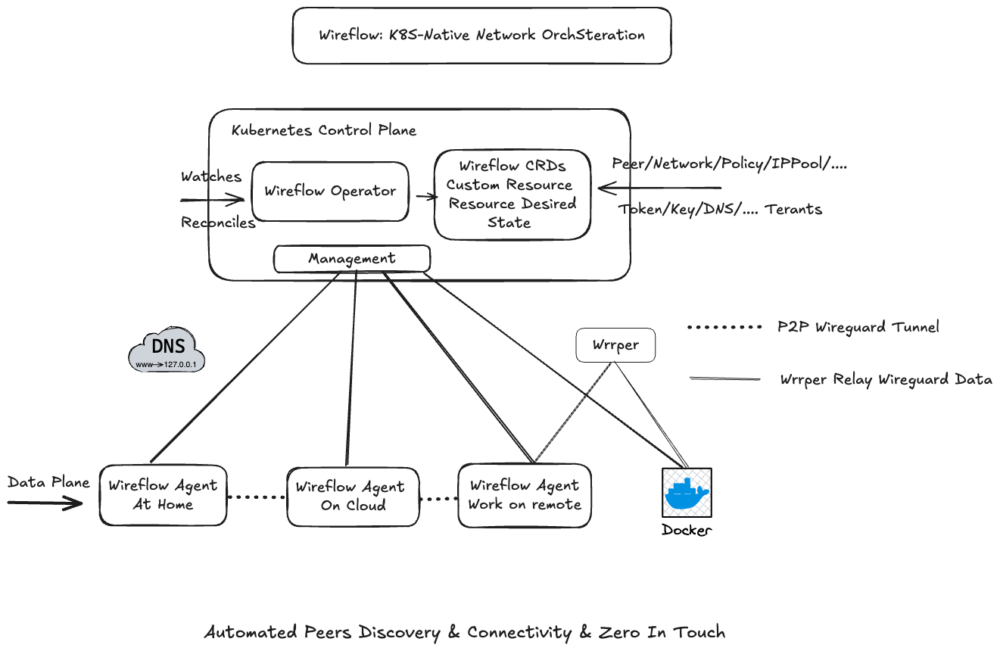

## Wireflow - Cloud Native WireGuard Management Platform

[](LICENSE)
[](https://goreportcard.com/report/github.com/wireflowio/wireflow)
[](CONTRIBUTING.md)

## Introduction

**Wireflow: A Cloud-Native Network Orchestration Solution based on Kubernetes CRDs.**

Wireflow is designed to simplify the construction of Overlay Networks across multi-cloud, cross-datacenter, and edge environments. 
It leverages Kubernetes-native primitives to automate the establishment and configuration of WireGuard tunnels.

* **Control Plane**: Based on the Kubernetes Operator pattern, it declaratively defines network topologies via Custom Resource Definitions (CRDs), serving as the "brain" of the cluster state.
* **Data Plane**: Deployed as a lightweight Agent, it establishes high-performance P2P tunnel connections between devices. It features robust NAT traversal capabilities to ensure the eventual consistency of the network state.

## Architecture


For more information, please visit our [official website](https://wireflow.run)

## Core Features

**Architecture & Core Security**

- Decoupled Architecture: The Control Plane handles decision-making while the Data Plane manages forwarding, ensuring that a single point of failure does not affect existing tunnel connectivity.
- High-Performance Tunnels: Enforces the use of the WireGuard (ChaCha20-Poly1305) protocol to provide extreme transmission performance and security.
- Zero-Touch Key Management: Automated key distribution and rotation. All configurations are managed by the Control Plane, enabling Zero-Touch Provisioning (ZTP).

**Kubernetes Native Integration**

* **Declarative API**: Manage your private network just like you manage Pods.
* **Automated IPAM**: Built-in IP Address Management to automatically allocate non-conflicting private IPs for tenants and nodes.
* **Intelligent Topology Orchestration**: Uses Kubernetes Labels to automatically discover nodes and orchestrate Mesh or Star network topologies.

## Quick Start

### Install Control Plane

You need a Kubernetes cluster with kubectl configured. We recommend using k3d for local deployment:

```bash
curl -sSL https://raw.githubusercontent.com/wireflowio/wireflow/master/hack/install-k3d.yaml | bash
```

### Install Data Plane

- latest version

```bash
curl -sSL https://raw.githubusercontent.com/wireflowio/wireflow/master/hack/install.sh | bash

# view the pod status
kubectl get pods -n wireflow-system
```

Run via Docker:

```bash
docker run -d --name wireflow --restart=always ghcr.io/wireflowio/wireflow:latest up
```

## Token Management

Wireflow uses a token-based authentication system. Tokens are required to authorize requests to the Control Plane API.

```bash
wireflow token create dev-team -n test --limit 5 --expiry 168h
```

Note: 
- dev-team: the name of the team that the token belongs to
- test: the name of the namespace that the token will be used for
- 5: the maximum number of concurrent connections allowed for the token
- 168h: the maximum lifetime of the token

### Run With Token:
```bash
wireflow up --token <token>
```

### Show Info In Control Plane

```aiignore
kubectl get wfpeer -n test
```

### Uninstall

To remove the Control Plane and cleanup:

```bash
curl -sSL -f https://raw.githubusercontent.com/wireflowio/wireflow/master/hack/uinstall-k3d.sh | bash
`````

## Development

### Requirements

- go version v1.24.0+
- docker version 17.03+.
- kubectl version v1.11.3+.
- Access to a Kubernetes v1.11.3+ cluster.

### Build from source:

```bash
git clone https://github.com/wireflowio/wireflow.git
cd wireflow
make build-all
```

## Badges


[](/LICENSE)
[](https://github.com/golangci/golangci-lint/releases/latest)
[](https://hub.docker.com/r/wireflowio/wireflow)
[](https://somsubhra.github.io/github-release-stats/?username=wireflowio&repository=wireflow)

## Contributors

This project exists thanks to all the people who contribute. [How to contribute](https://wireflow.run).

<a href="https://github.com/wireflowio/wireflow/graphs/contributors">
  
</a>

## Features & Roadmap

### **Implemented**
- Zero-Touch Networking: Automated device registration and configuration.
- K8s Native Orchestration: CRD-based node discovery and connection scheduling.
- Security Hardening: Centralized key management with WireGuard kernel encryption.
- Flexible Networking: Built-in IPAM and declarative Access Control Lists (ACL).

### **Future Milestones (Planned)**

- Multi-Cloud & Multi-Region: Bridge network silos across different cloud providers and physical regions.
- Multi-Tenancy & RBAC: Tenant isolation with a centralized Web UI for management.
- Operational Visibility: Prometheus exporters for traffic monitoring and alerting.
- Smart Service Discovery: Integrated DNS for secure internal service naming.

## Disclaimer

This tool is intended for technical research, enterprise internal networking, and compliant remote access only.
- Users must comply with all local laws and regulations.
- Strictly prohibited for any activities violating the Cybersecurity Law of the People's Republic of China (including unauthorized cross-border channels).
- The authors assume no liability for any illegal use of this tool.

## License

Apache License 2.0

